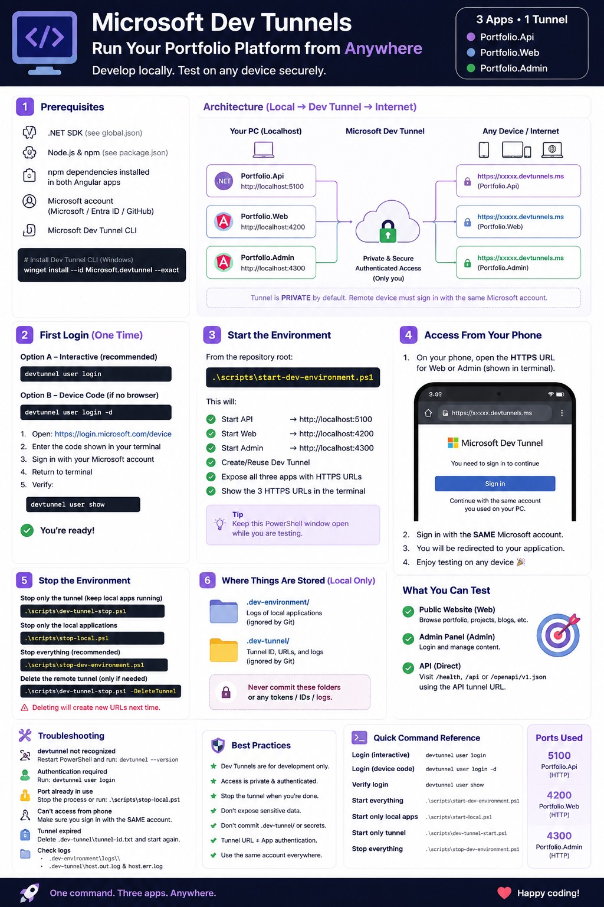

# Sultan Alomran Portfolio Platform

A personal engineering portfolio and technical-content platform built as two independent Angular clients and an ASP.NET Core Clean Architecture backend.

## Foundation status 

1. **Solution foundation — complete.** The API composition root, dependency boundaries, public/client shells, automated tests, and CI validation are established.
2. **Complete data foundation — complete.** SQL Server and EF Core model the approved 45 entities for profile, taxonomy, Visual Handbook, projects, media, learning paths, engagement, analytics, authorization, tokens, and auditing.
3. **Data-foundation cleanup — complete.** Entity mappings are colocated with their `IEntityTypeConfiguration<TEntity>` implementations, DbSet naming is consistent, committed credentials are removed, and the reviewed `InitialDataFoundation` migration is available.
4. **Projects vertical slice — implemented.** Published listing/details and the Admin management/wizard experience are connected end-to-end through typed API contracts. The `ProjectsVerticalSlice` migration adds featured and structured case-study content.

The model supports Arabic and other multilingual text through Unicode `nvarchar` columns. Selective soft deletion applies only to Category, Infographic, Project, Series, and ReadingPath, with active-row filtered uniqueness. Custom authorization persistence stores users, roles, permissions, junctions, sessions, and cryptographic token hashes—never raw tokens. Deterministic reference seed data contains roles, permissions, and safe configuration only; it contains no account, credential, secret, token, or analytics data.

## Structure and dependency direction

`Domain` and `Shared` are innermost. `Application` references them; `Infrastructure` owns EF Core and references the inner projects; `Portfolio.Api` is the composition root. The Angular applications communicate only through HTTP/API contracts.

```text
src/Portfolio.Api             API composition root
src/Portfolio.Application     use-case boundary
src/Portfolio.Domain          dependency-free domain model
src/Portfolio.Infrastructure  EF Core and technical adapters
src/Portfolio.Shared          shared .NET primitives
src/Portfolio.Web             public Angular client
src/Portfolio.Admin           private Angular client
tests/                        unit, architecture, metadata, and integration tests
```

## Database environments and configuration

Development requires SQL Server Developer Edition, compatible LocalDB, or a local SQL Server container. CI should use a disposable SQL Server container/database. Production targets Azure SQL Database; configuration belongs in Azure environment variables or Key Vault, with managed identity preferred when supported.

Supply `ConnectionStrings__PortfolioDatabase` locally. The committed `appsettings.json` deliberately contains an empty value. Development alternatives include environment variables, `dotnet user-secrets`, local Docker configuration, or an ignored developer-local settings file. Copy `.env.example` and replace `<LOCAL_PASSWORD>` locally; never commit it.

The initial migration is `InitialDataFoundation`; the Projects extension is `ProjectsVerticalSlice`. The API never applies migrations automatically at startup.

## Local prerequisites

- Visual Studio Community 2026 18.8.2 with the ASP.NET and web development workload
- .NET SDK 10.0.100 (selected through `global.json`)
- Node.js `>=22.12.0 <23` (verified with 22.23.1) and npm 10.9.8
- SQL Server LocalDB, SQL Server Developer, or an isolated local SQL Server container

The verified local setup uses a dedicated LocalDB instance named `PortfolioPlatformLocal`. Start it and store the development connection outside Git:

```powershell
sqllocaldb start PortfolioPlatformLocal
dotnet user-secrets set "ConnectionStrings:PortfolioDatabase" "Server=(localdb)\PortfolioPlatformLocal;Database=PortfolioPlatformDev;Trusted_Connection=True;MultipleActiveResultSets=True;TrustServerCertificate=True" --project src/Portfolio.Api
dotnet dev-certs https --trust
```

## Restore, build, and run

```powershell
dotnet tool restore
dotnet restore Portfolio.sln
dotnet build Portfolio.sln --configuration Release --no-restore
dotnet test Portfolio.sln --configuration Release --no-build
dotnet ef database update --project src/Portfolio.Infrastructure --startup-project src/Portfolio.Api
dotnet run --project src/Portfolio.Api --launch-profile https
```

Restore and run each Angular application independently. Their committed lockfiles make `npm ci` the normal restore command.

```powershell
Set-Location src/Portfolio.Web
npm ci
npm run build
npm start # http://localhost:4200

Set-Location ../Portfolio.Admin
npm ci
npm run build
npm start # http://localhost:4300
```

The API listens on `https://localhost:7100` and `http://localhost:5100`. Its OpenAPI document is at `https://localhost:7100/openapi/v1.json`; this foundation does not include a Swagger UI page.

## Remote development with Microsoft Dev Tunnels

Portfolio.Web (`4200`), Portfolio.Admin (`4300`), and Portfolio.Api (`5100`) run locally while Microsoft Dev Tunnels exposes each service through a private HTTPS development URL. This is development and testing infrastructure, not production hosting.



Start the local applications and private, authenticated tunnel from the repository root:

```powershell
.\scripts\start-dev-environment.ps1
```

While the development PC and tunnel host are running, authorized accounts can access:

- Public Web: `https://snbh8kgz-4200.asse.devtunnels.ms/`
- Admin: `https://snbh8kgz-4300.asse.devtunnels.ms/`
- API: `https://snbh8kgz-5100.asse.devtunnels.ms/`
- API health: `https://snbh8kgz-5100.asse.devtunnels.ms/health`
- OpenAPI: `https://snbh8kgz-5100.asse.devtunnels.ms/openapi/v1.json`

The development PC, all local applications, and the tunnel host must remain running. Access is private and authenticated; remote users must sign in with an account authorized for the tunnel. URLs may change when the tunnel expires or is recreated. Never place credentials, tokens, secrets, or authentication data in this README.

Real-device access has been verified over the Internet from an iPhone for Portfolio.Web, Portfolio.Admin, and the API health endpoint. Stop the complete environment with:

```powershell
.\scripts\stop-dev-environment.ps1
```

See [docs/development/DevTunnel.md](docs/development/DevTunnel.md) for setup, security, reuse, and troubleshooting details.

## Automated browser testing

Playwright provides automated Admin and public-site regression testing without Dev Tunnels. After restoring the root lockfile and installing Chromium, run `npm run e2e:smoke`; Playwright owns application startup/readiness/cleanup. Normal PRs run the efficient smoke suite automatically, while the `e2e-visual` and `e2e-record` labels request successful screenshots or full review recordings. See [tests/playwright/README.md](tests/playwright/README.md) for local commands, artifacts, debugging, and the future vertical-slice convention.

## Validation

```bash
dotnet restore Portfolio.sln
dotnet build Portfolio.sln --configuration Release --no-restore
dotnet test Portfolio.sln --configuration Release --no-build
dotnet format Portfolio.sln --verify-no-changes --no-restore
dotnet list Portfolio.sln package --vulnerable --include-transitive
dotnet ef migrations has-pending-model-changes --project src/Portfolio.Infrastructure --startup-project src/Portfolio.Api
```

Projects integration tests use a uniquely named disposable database on the local `PortfolioPlatformLocal` LocalDB instance and remove it afterward. Metadata and architecture tests validate the model without touching production. NuGet auditing, warnings-as-errors, and NU1903 enforcement remain enabled.

## Projects routes and boundaries

- Public UI: `/projects` and `/projects/:slug`
- Admin UI: `/projects`, `/projects/create`, and `/projects/:id/edit`
- Public API: `GET /api/projects`, `GET /api/projects/{slug}`, and `GET /api/technologies`
- Admin API: list/details/create/update/delete, draft, publish readiness, publish, archive, feature/unfeature, and technology lookup under `/api/admin`

Project images reference existing `MediaFile` records. Binary upload/storage, authentication, project categories/types, related content, and view tracking remain deferred; the UI does not simulate those capabilities.

## Next work

Complete manual visual and accessibility review of the Projects pages, then connect Media Library storage and authentication when those slices are approved.
